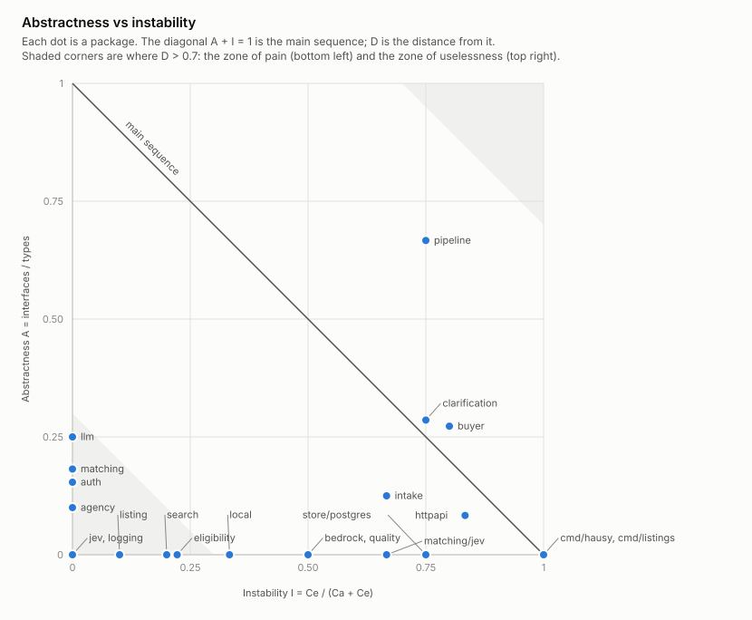
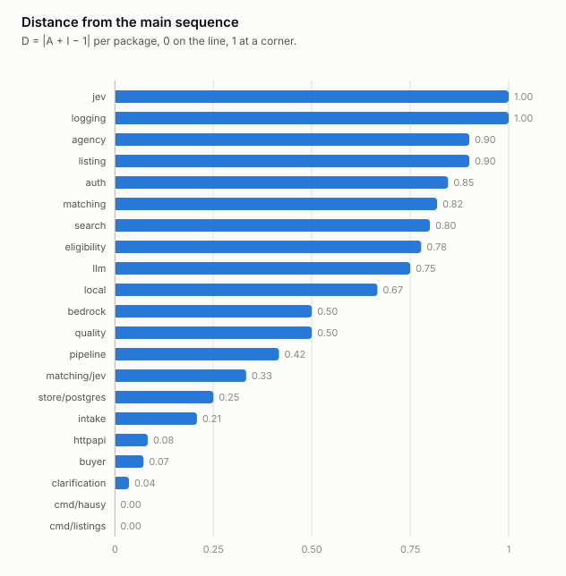
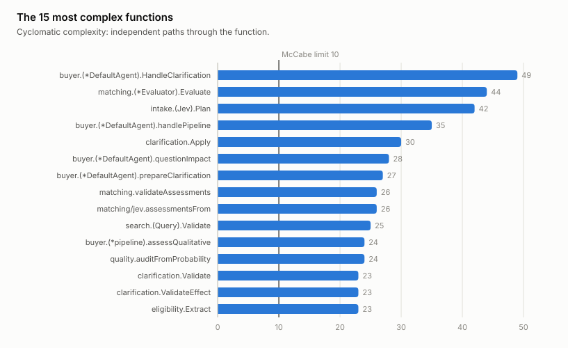

# Metrics snapshot

`github.com/Grupo-6-Seminario/proyecto-angus-back` at `684936a-dirty`, measured by `go run ./cmd/metrics`.
What each number means and how to compare snapshots: `docs/metrics/README.md`.

| Summary | Value |
| --- | ---: |
| Packages | 21 |
| Mean distance from the main sequence | 0.52 |
| Packages with D > 0.7 | 9 |
| Functions | 293 |
| Mean cyclomatic complexity | 6.05 |
| Median cyclomatic complexity | 4 |
| Functions over 10 | 36 (12.29%) |
| Highest | 49, `buyer.(*DefaultAgent).HandleClarification` |

## Package design: abstractness, instability, distance

Far from the main sequence (D > 0.7): `internal/jev`, `internal/logging`, `internal/agency`, `internal/listing`, `internal/auth`, `internal/matching`, `internal/search`, `internal/eligibility`, `internal/llm`.

| Package | A | I | D | Ca | Ce | Types | Interfaces | Third-party imports |
| --- | ---: | ---: | ---: | ---: | ---: | ---: | ---: | ---: |
| `internal/jev` | 0.00 | 0.00 | 1.00 | 7 | 0 | 5 | 0 | 0 |
| `internal/logging` | 0.00 | 0.00 | 1.00 | 4 | 0 | 1 | 0 | 0 |
| `internal/agency` | 0.10 | 0.00 | 0.90 | 2 | 0 | 10 | 1 | 0 |
| `internal/listing` | 0.00 | 0.10 | 0.90 | 9 | 1 | 6 | 0 | 0 |
| `internal/auth` | 0.15 | 0.00 | 0.85 | 3 | 0 | 13 | 2 | 0 |
| `internal/matching` | 0.18 | 0.00 | 0.82 | 2 | 0 | 11 | 2 | 0 |
| `internal/search` | 0.00 | 0.20 | 0.80 | 4 | 1 | 4 | 0 | 0 |
| `internal/eligibility` | 0.00 | 0.22 | 0.78 | 7 | 2 | 14 | 0 | 0 |
| `internal/llm` | 0.25 | 0.00 | 0.75 | 8 | 0 | 4 | 1 | 0 |
| `internal/local` | 0.00 | 0.33 | 0.67 | 2 | 1 | 4 | 0 | 0 |
| `internal/bedrock` | 0.00 | 0.50 | 0.50 | 1 | 1 | 1 | 0 | 3 |
| `internal/quality` | 0.00 | 0.50 | 0.50 | 3 | 3 | 3 | 0 | 0 |
| `internal/pipeline` | 0.67 | 0.75 | 0.42 | 1 | 3 | 6 | 4 | 0 |
| `internal/matching/jev` | 0.00 | 0.67 | 0.33 | 1 | 2 | 1 | 0 | 0 |
| `internal/store/postgres` | 0.00 | 0.75 | 0.25 | 2 | 6 | 2 | 0 | 3 |
| `internal/intake` | 0.12 | 0.67 | 0.21 | 3 | 6 | 8 | 1 | 0 |
| `internal/httpapi` | 0.08 | 0.83 | 0.08 | 1 | 5 | 12 | 1 | 0 |
| `internal/buyer` | 0.27 | 0.80 | 0.07 | 2 | 8 | 22 | 6 | 0 |
| `internal/clarification` | 0.29 | 0.75 | 0.04 | 2 | 6 | 7 | 2 | 0 |
| `cmd/hausy` | 0.00 | 1.00 | 0.00 | 0 | 12 | 1 | 0 | 2 |
| `cmd/listings` | 0.00 | 1.00 | 0.00 | 0 | 7 | 0 | 0 | 0 |

## Cyclomatic complexity

| Band | Functions | Share |
| --- | ---: | ---: |
| 1–10 simple | 257 | 87.71% |
| 11–20 moderate | 16 | 5.46% |
| 21–50 complex | 20 | 6.83% |
| over 50 untestable | 0 | 0.00% |

| Function | Complexity | Position |
| --- | ---: | --- |
| `buyer.(*DefaultAgent).HandleClarification` | 49 | `internal/buyer/clarification.go:82` |
| `matching.(*Evaluator).Evaluate` | 44 | `internal/matching/matching.go:82` |
| `intake.(Jev).Plan` | 42 | `internal/intake/jev.go:78` |
| `buyer.(*DefaultAgent).handlePipeline` | 35 | `internal/buyer/pipeline.go:86` |
| `clarification.Apply` | 30 | `internal/clarification/clarification.go:206` |
| `buyer.(*DefaultAgent).questionImpact` | 28 | `internal/buyer/clarification.go:424` |
| `buyer.(*DefaultAgent).prepareClarification` | 27 | `internal/buyer/clarification.go:245` |
| `matching.validateAssessments` | 26 | `internal/matching/matching.go:192` |
| `matching/jev.assessmentsFrom` | 26 | `internal/matching/jev/client.go:87` |
| `search.(Query).Validate` | 25 | `internal/search/search.go:92` |
| `buyer.(*pipeline).assessQualitative` | 24 | `internal/buyer/pipeline.go:395` |
| `quality.auditFromProbability` | 24 | `internal/quality/quality.go:87` |
| `clarification.Validate` | 23 | `internal/clarification/clarification.go:126` |
| `clarification.ValidateEffect` | 23 | `internal/clarification/clarification.go:161` |
| `eligibility.Extract` | 23 | `internal/eligibility/extract.go:58` |

| Package | Functions | Mean | Max |
| --- | ---: | ---: | ---: |
| `internal/buyer` | 40 | 8.30 | 49 |
| `internal/matching` | 4 | 23.25 | 44 |
| `internal/intake` | 30 | 7.03 | 42 |
| `internal/clarification` | 18 | 7.17 | 30 |
| `internal/matching/jev` | 6 | 6.83 | 26 |
| `internal/search` | 6 | 6.50 | 25 |
| `internal/quality` | 6 | 7.00 | 24 |
| `internal/eligibility` | 15 | 7.33 | 23 |
| `internal/agency` | 11 | 5.55 | 20 |
| `cmd/listings` | 10 | 7.30 | 17 |
| `internal/httpapi` | 20 | 4.70 | 15 |
| `internal/listing` | 23 | 3.78 | 15 |
| `internal/local` | 4 | 7.00 | 15 |
| `cmd/hausy` | 8 | 4.00 | 12 |
| `internal/bedrock` | 4 | 6.00 | 12 |
| `internal/jev` | 7 | 6.43 | 11 |
| `internal/store/postgres` | 49 | 4.31 | 11 |
| `internal/auth` | 19 | 2.74 | 9 |
| `internal/logging` | 3 | 4.00 | 8 |
| `internal/pipeline` | 10 | 5.60 | 8 |
| `internal/llm` | 0 | 0.00 | 0 |

Every function is in `functions.csv`; every package in `packages.csv`.

## Benchmarks

Medians of each benchmark's runs on Intel(R) Core(TM) Ultra 7 355. Raw runs are in `bench.txt`; compare two snapshots with benchstat, on the same machine.

| Benchmark | Time/op | Memory/op | Allocs/op | Runs |
| --- | ---: | ---: | ---: | ---: |
| `buyer.Turn` | 1.00 ms | 634.6 KiB | 572 | 10 |
| `eligibility.Assess` | 26.51 µs | 11.6 KiB | 88 | 10 |
| `eligibility.Relaxations` | 47.90 µs | 16.7 KiB | 175 | 10 |
| `pipeline.Parse` | 13.93 ms | 2.99 MiB | 38335 | 10 |
| `pipeline.Load` | 12.04 ms | 3.07 MiB | 17822 | 10 |
| `store/postgres.Candidates` | 3.67 ms | 654.1 KiB | 6280 | 10 |
