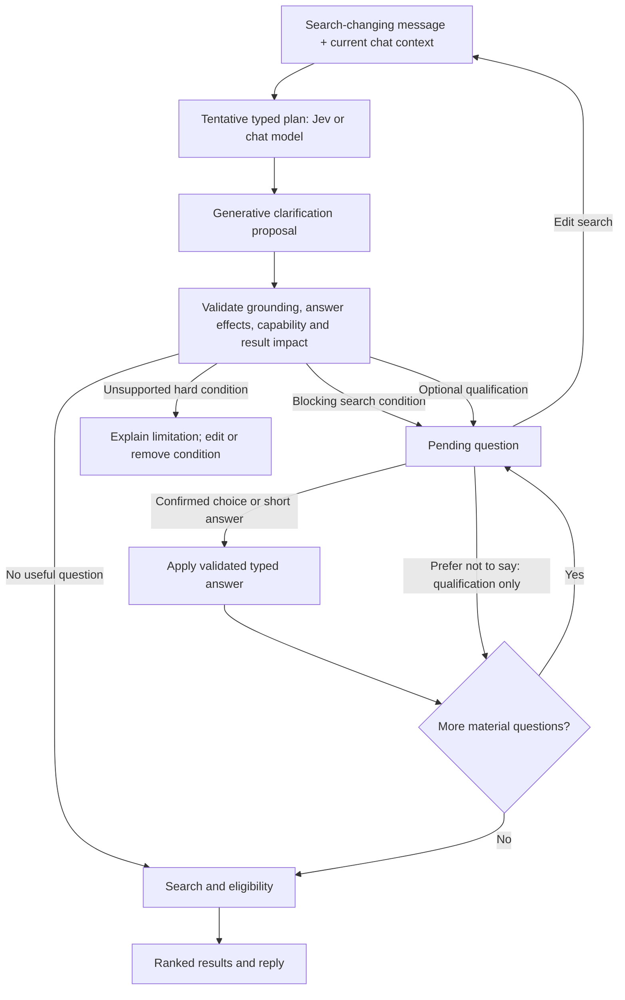

# Search clarification — design in progress

**Status:** approved for implementation. The domain terms are in [CONTEXT.md](../../CONTEXT.md), and the generative proposal decision is in [ADR 0003](../../docs/adr/0003-typed-clarification-before-search.md).

## Purpose

When a stated condition has materially different plausible meanings, Hausy asks for the missing decision before claiming results satisfy it. Examples include an unnamed amenity or an unclear room count. A volunteered qualification fact can also be clarified, but answering it is optional. Subjective qualities that can be judged from listing evidence, such as "mucha luz", do not automatically trigger a question.

The feature favors precision and as few interruptions as possible. It never invents a hard filter, silently drops a detected requirement, or asks for an answer that the supported search and eligibility modules cannot use.

For example, the current search has no commute or work-location filter. "Cerca del trabajo" cannot trigger a work-location question yet, because supplying that location would not change the search. If it is a hard condition, Hausy explains the limitation and offers to edit or remove it. The same capability rule applies to amenities until the inventory has searchable amenity data.

## Turn flow

- The proposer runs on every new or refined search turn, including when Jev made the tentative plan. It sees the conversation, available context, and tentative plan. When the chat model is the planner, one call may produce both outputs; Jev needs a generative call because it only evaluates supplied choices.
- A question identifies the user's phrase or known fact that prompted it (for example, "Cuando dijiste 'con amenities'…"). The user can correct a misreading through "Ninguna de estas" or "Editar búsqueda".
- The application validates a proposed question before displaying it. A choice has a specific typed effect, rather than a label sent back for open-ended replanning. A short text answer is converted to a typed value and validated before use. Multiple selected required amenities all apply.
- Questions appear one at a time. Hard filters take priority, although their exact order is not a product invariant. There is no fixed question-count cutoff; this must be measured because a long interview is a bad outcome.
- A blocking search condition requires clarification or explicit removal. An optional qualification question offers "Prefiero no decir"; that refusal suppresses further questions about the fact for the rest of this chat. Eligibility remains unknown where the missing fact prevents assessment.
- While a question is pending, the ordinary composer is paused. "Ninguna de estas" opens a short, validated answer. "Editar búsqueda" cancels the pending questions and returns to the request.
- Confirmed answers and refusals persist for later turns of this chat only. A page reload in the same browser chat resumes the pending question. A new chat or session starts fresh; switching browsers or restoring after closing the window is outside this promise. A later explicit message overrides an earlier answer or saved account fact.
- When a proposal fails, deterministic checks remain. A valid plan can proceed only if no known unresolved condition is being discarded. An unsupported hard condition stops with an explanation and an edit or remove path.
- This is one pre-search proposal pass. Zero results after a resolved search use the existing zero-results flow; there is no second model interrogation in this version.

## Modules and interfaces

| Module | Current interface | Proposed change at its seam |
| --- | --- | --- |
| `internal/intake` | `Planner.Plan(ctx, turns, previous) -> Plan`, validated before return | Return a tentative plan plus any parse/validation problems, so a vague required field can reach clarification instead of becoming a 502. Preserve Jev and chat-model adapters behind the planner interface. |
| New clarification module | None | Accept conversation, available context, tentative plan, and supported search capabilities; propose and validate at most one displayed question at a time. Keep the generative adapter replaceable and the decision policy in application code. |
| `internal/buyer` | `HandleMessage` runs plan → search → eligibility → writer | Add a pending-clarification turn outcome and store question IDs, plan revision, validated effects, and confirmed answers in the chat session. Apply an answer before search; bypass the writer while asking. |
| `internal/httpapi` | `POST /api/messages` accepts a message and returns/streams results and reply | Add a typed answer input and a clarification outcome. Reject answers tied to an obsolete question or plan revision. Preserve the existing results-before-reply stream for completed searches. |
| `frontend/` | Composer sends text; `readTurn` accepts results/reply/done | Render the pending question and choices or short input, pause ordinary submissions, and offer "Editar búsqueda". Keep the same opaque chat ID through a reload of that browser chat. |

The current `Planner.Plan` returns only a fully validated `Plan`; the `amenity=any` case fails before the buyer pipeline can ask anything. The tentative-plan seam must retain enough of an invalid or omitted condition for the proposer to inspect it. A generated question is not proof of ambiguity by itself: code checks its cited phrase or fact against the conversation and validates its possible effects against `search.Query`, the eligibility vocabulary, and current search capabilities. Labeled evaluations must test whether the proposed question actually follows from that source. For finite, exhaustive choices, a bounded inventory preview can reject questions whose answers cannot affect displayed results.

A typed answer is bound to the pending question ID and plan revision. A confirmed choice applies its validated plan effect directly; short text is normalized to a typed value and validated before application. Confirmed values stay in the current chat so a later planning turn does not reinterpret the user's selected label. "Editar búsqueda" invalidates the pending revision, and a stale answer cannot mutate the newer search.

The browser keeps an opaque chat ID across a reload in the same tab or browser chat; the backend retains the pending question in that chat session. A fresh chat gets a fresh ID. Recovery after the backend loses its in-memory session is outside the promised reload behavior and returns the searcher to an editable request.

## Question threshold

An answer must be capable of changing listing membership, ranking, or eligibility, not merely the wording of the reply. For finite, exhaustive choices, a bounded check against current candidates avoids asking when alternatives cannot change the displayed result. The initial policy favors strong evidence for ambiguity over asking on every vague phrase.

## Verification before rollout

Use hand-labeled ambiguous and ordinary searches to measure missed material ambiguities and unnecessary questions. Measure question frequency, interview completion, search completion, and added wait time in the running flow. Set numerical release thresholds after a baseline is measured.

The acceptance set should cover: generic amenities causing a question once searchable amenity data exists, and ambiguous room counts causing a question; a clear search and evidence-backed "mucha luz" proceeding without one; "cerca del trabajo" receiving a capability explanation while commute search is unsupported; a known fact suppressing a repeated question once its search capability exists; an unsupported hard condition yielding a clear stop; two independent questions asked sequentially; "Prefiero no decir" suppressing that qualification fact for the chat; "Ninguna de estas" accepting a validated short answer; reload resuming a pending question; edit/search revision rejecting a stale answer; and a proposer outage preserving a valid plan without silently dropping a detected hard condition. The current committed listing snapshot has no stored amenity attributes, so the amenities result path needs data coverage before it can be verified against the real inventory.

## Later UI improvement

Editable interpreted-filter chips or dropdowns, like the operation, neighborhood, and room-count chips in the Roomix reference screenshot, are a separate improvement. The first version uses the clarification question and an "Editar búsqueda" route back to the composer.

Future proximity search could geocode a user-supplied location and calculate distance or travel time from listings to places such as subway entrances or a workplace. That would make "cerca del trabajo" and similar conditions actionable. It requires reliable listing coordinates, location privacy rules, and a defined distance or travel-time threshold; it is outside the initial clarification flow.

## Implementation notes

- **HTTP shapes (implemented).** `POST /api/messages` takes either `{session_id, message, qualification?}` or `{session_id, answer: {question_id, selected?: [choice ids], other?: text, action?: "edit" | "remove" | "decline"}, qualification?}`; an answer carries no `message`. A turn that asks returns `clarification` (`id`, `request`, `source`, `prompt`, `kind`, `can_remove`, `fact`, `multi`, `choices[{id, label, effects}]`; the browser sends back only choice IDs and the server applies its stored effects) instead of results; streamed turns send it in the `done` event. An unreadable free-text answer returns the same question with `clarification_hint`. `GET /api/messages?session_id=…` returns `{clarification: question | null}` for a reload. A stale question ID, or a new message while a question is pending, is `409`.
- **Qualification panel.** A fact the panel already declares, or one the searcher declined, is never asked about.
- **Deterministic fallbacks.** Generic "con amenities" comes back from intake as `*intake.Unresolved` beside a valid plan that is never searched, and the planner does not fall back on it (named amenities, synonyms included, are kept as the requirement instead). The buyer asks about it from the listing vocabulary when no valid model question covers it. "Cerca del trabajo" stops with that phrase cited. A later turn cannot re-read an answered "con amenities" as every amenity.
- **Live measurement (Qwen3.5-9B planner and proposer, 2026-09-25, 8 labeled cases).** The proposer produced no valid question in any case: `ambiguous_rooms` and `vague_income` got none, and `unnamed_amenities` got a malformed one. The four "no question" cases pass trivially. Planner 4.3–11 s and proposal 1.6–3.1 s per search turn.
- **Judge vs. proposer (21 labeled cases, 10 real ambiguities, `experiments/ambiguity`, 2026-09-25).** Jev judging one typed yes/no question per plan field caught 8/10 real ambiguities, including phrasings its questions never named ("2 cuartos", "3 piezas", "todos los chiches del edificio", "hasta 900"). It raised 2 false alarms on 11 clear searches, both of which plan-aware gating would drop: the plan already carries the typed guarantee, or it has no budget for a currency question to change. It took about 0.4 s per turn. It missed "dos habitaciones" (0.36), which it reads as bedrooms, and "cobro en blanco" (0.48). Claude Sonnet 4.6 on Bedrock as the generative proposer caught 1/10 with the same 2 false alarms, taking 2.7 s. Most of its questions failed validation on values or fields the typed effects do not admit, so writing typed options is the weak step, not seeing the ambiguity.
- **End to end with the Jev judge (`experiments/ambiguity -mode buyer`, real buyer on the refreshed snapshot, 2026-09-25).** 20 of 21 searches got the expected outcome, with no question on any of the 12 clear searches. Questions were asked for "con amenities", "todos los chiches del edificio", "2 cuartos", "hasta 900" and both vague guarantees. "Dos habitaciones" is planned as dormitorios (CONTEXT.md). "Cerca del trabajo" stops as unsupported. Income is not asked where almost no listing publishes an income requirement the answer could change. The one miss is "3 piezas" (Jev 0.39–0.50). The planner dominates turn latency at about 5 s; an amenities question adds about 5 s of preview ranking. The inventory covers only Monserrat, Congreso and Palermo.
