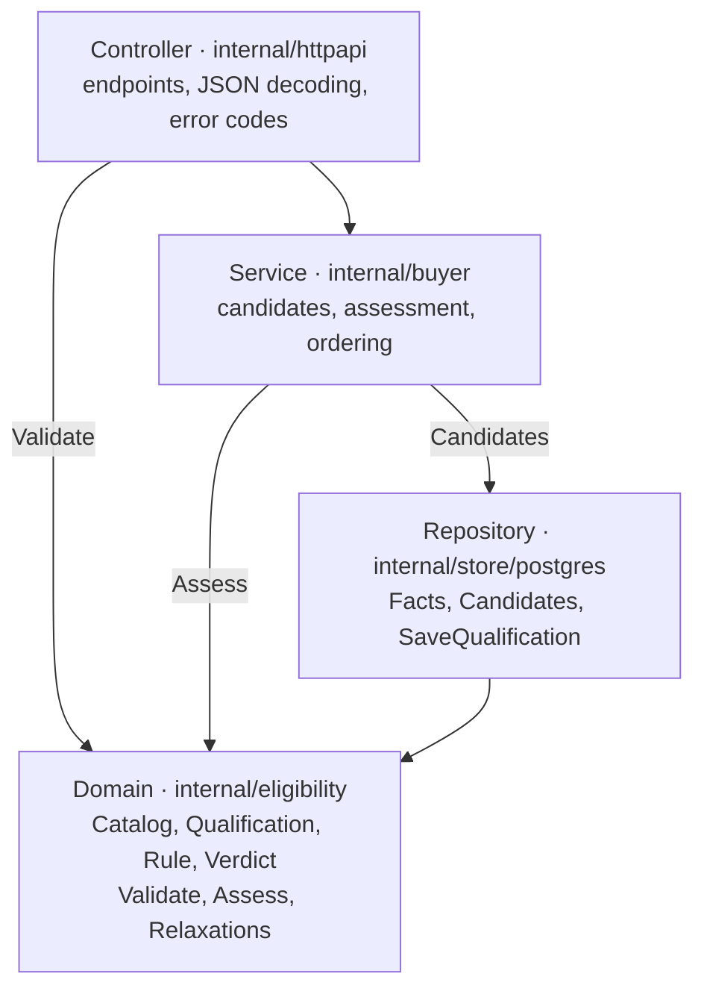

# Eligibility filter: back office spec

**Date**: 2026-10-02 | **Owner**: Martin | **Status**: phase 2 done; phase 1 approved, ready to build
**Prompts for Claude Code**: [prompts.md](./prompts.md)

This spec defines how the Hausy eligibility filter is built, in four phases. Phase 1 defines the
searcher facts; its decisions are recorded in 1.5. Phase 2 picks the evaluator pattern, phase 3
assigns the work to layers and phase 4 lists the test cases.

In 517 CABA rental listings from three portals, a guarantee is the most requested requirement
(32% of listings), followed by documented income (12%) and a no-pets rule (10%). Employment type
and job tenure appear in under 1%, so they get low priority.

## Phase 1: requirements and facts

Which searcher facts are compared against each property's rules, in what priority, and which may
never be asked.

### 1.1 Requirement ranking in CABA

The guarantee is the most requested requirement: 163 of 517 listings (32%). In 91 of them the
listing accepts propietaria or caución as alternatives. Documented income and the no-pets rule come
next. Employment type, job tenure and occupancy caps appear in under 1% of listings, so those rules
will come from what agencies declare rather than from listing text.

Searcher requirements by priority for the filter:

1. **High** (over 10% of listings): guarantee (caución and propietaria), documented income, pets.
2. **Medium** (1% to 10%): pay slips and income multiple.
3. **Low** (under 1%): employment certificate, occupancy cap, employment type, job tenure, children.

| Requirement | Kind | Listings (of 517) | Share |
| --- | --- | ---: | ---: |
| Requires some guarantee | Searcher | 163 | 32% |
| Deposit | Contract | 148 | 29% |
| Accepts caución | Searcher | 144 | 28% |
| Accepts propietaria guarantee | Searcher | 108 | 21% |
| Month in advance | Contract | 91 | 18% |
| Documented income | Searcher | 64 | 12% |
| No pets | Searcher | 54 | 10% |
| Contract term | Contract | 40 | 8% |
| Pay slips | Searcher | 26 | 5% |
| Fire or home insurance | Contract | 18 | 3% |
| Income multiple (e.g. 3×) | Searcher | 12 | 2% |
| Employment or income certificate | Searcher | 4 | 1% |
| Occupancy cap | Searcher | 4 | 1% |
| Monotributo paperwork | Searcher | 3 | 1% |
| Employee (relación de dependencia) | Searcher | 2 | 0% |
| Job tenure | Searcher | 2 | 0% |
| No children | Searcher | 1 | 0% |

Contract conditions are shown on the card and never change eligibility.

Shares agree across portals: caución appears in 24% of Zonaprop listings and 32% of Mercado Libre
listings, documented income in 12% of both, and the no-pets rule in 11% and 10%.

Sample limits (read on 2026-10-02):

- **Zonaprop:** live requests are blocked for automated clients, so the sample is the 300 committed
  listings in `data/listings.jsonl`, which cover only Monserrat, Congreso and Palermo.
- **Mercado Libre:** 210 listings across CABA, taken from several result pages.
- **Argenprop:** only 7; the site started rate-limiting and the scan stopped.
- **Properati and Inmuebles24:** refused the requests.

Counts come from keyword search over descriptions and carry error. Before fixing priorities, label
50 Mercado Libre listings by hand, as was done for guarantees (`experiments/eligibility`).

### 1.2 Starting point in the code

The code already solves the hard part: rules are data and a pure Go evaluator compares them with what
the searcher declares ([ADR 0001](../../docs/adr/0001-eligibility-rules-as-data.md)). Adding a fact
is a row in `eligibility_facts` and, when needed, an extraction pattern. The evaluator changes only
for a new operator.

| Piece | Today |
| --- | --- |
| Admissible facts | `guarantee` (propietaria, caucion), `income_band` (4 ARS bands), `caucion_quoted` (yes/no) |
| Inadmissible facts | `age`, `nationality`, `gender` |
| Operators | `one_of` (accepts any of these values) and `income_multiple` (income ≥ N × rent) |
| Hardness | `hard` or `discretionary` (the owner decides case by case) |
| Rule source | `parsed` (read from the listing); `declared` and `observed` exist in the schema but are unused |
| Extracted rules | 84 of 300 listings: 78 hard guarantee, 6 discretionary guarantee, 4 income multiple |

The four states stay: eligible, conditionally eligible, unknown and ineligible. An undeclared fact
yields unknown, never eligible.

### 1.3 Fact catalog

Priority comes from the ranking in 1.1. In phase 1 the searcher declares every fact and nobody
verifies it. The last column names the document that would verify it once a verification step exists.

| Priority | Fact | Name | Searcher declares | Listing rule | Status | Verified later by |
| --- | --- | --- | --- | --- | --- | --- |
| High | Guarantee | `guarantee` | `propietaria`, `caucion`, `recibos_garante` | `one_of`, hard or discretionary | Exists; add pay slips | Property title report, insurer policy or guarantor pay slips |
| High | Documented income | `income_documented` | yes / no | `one_of [yes]` | New | Pay slips or invoices |
| High | Pets | `pets` | none, dog, cat | `one_of [none]` when the listing refuses pets; `[none, dog]` or `[none, cat]` when it refuses only cats or only dogs; discretionary when the owner keeps the call | New (today a search attribute) | Not verified |
| Medium | Income | `income_band` | monthly ARS band | `income_multiple` (e.g. 3 × rent, or "rent may not exceed 30% of income") | Exists; a USD rent yields unknown | Pay slips or invoices |
| Medium | Caución quoted | `caucion_quoted` | yes / no | no rule uses it yet | Exists | Insurer quote |
| Low | Employment type | `employment_type` | employee, monotributo, responsable inscripto, retired, no own income | `one_of` | New; may move to a later phase | Pay slips, ARCA registration or pension slip |
| Low | Job tenure | `employment_tenure` | under 6 months, 6–12, 12–24, over 24 | `min_months` (new operator) | New; may move to a later phase | Employment certificate or ARCA registration date |

Insurance splits in two. Caución is a guarantee and enters as a `guarantee` value. Fire or home
insurance is a contract obligation and says nothing about whether the searcher can rent.

**Shown on the card, never changes eligibility:** deposit, month in advance, fire or home insurance,
contract term, fees and professional use.

**Out of phase 1:** credit report (Veraz, Nosis). Under 1% of listings ask for it, and declaring it
means nothing without a real lookup.

### 1.4 Legal limits and inadmissible facts

An inadmissible fact is never asked or stored. If a listing requires one, the rule is ignored and
recorded in `Ignored`. Proposed additions to the three that exist:

| Fact | Why it is inadmissible | Listing example |
| --- | --- | --- |
| Age, nationality, gender | Already marked in the schema | — |
| Marital status, religion, ideology | Protected characteristics | none |
| Children or household composition | Filters by who the family is, not by ability to pay | "ni se aceptan niños" (1 listing) |
| Holding an Argentine DNI | Works as a nationality filter | none requires it |

Two points need legal review before launch (cited from memory, not checked against the text):

- Ley 23.592 lists "posición económica" and "condición social" among grounds of discrimination.
  Income multiples are common practice, but confirm that Hausy may filter on them.
- An occupancy cap ("máximo 2 personas") is a property fact, not a family fact. It stays an open
  decision because it can be used to exclude families with children.

### 1.5 Acceptance criteria and decisions

Phase 1 ends when the catalog is approved. It includes no code. Later implementation is accepted
when:

- [ ] Each approved fact is an `eligibility_facts` row with its admissible flag and choices.
- [ ] The form stays optional. "Prefiero no decir" leaves the fact undeclared and the property
      unknown, never eligible.
- [ ] A rule on an inadmissible fact is ignored and reported, as age and nationality are today.
- [ ] Each new rule keeps the listing text it came from.
- [ ] Extraction is measured against hand-labeled listings before it is trusted, as guarantees were
      (20/20).
- [ ] What the card shows (deposit, insurance, term) never changes an eligibility state.

Decisions, approved by Martin on 2026-10-02:

1. **Propietaria guarantee: one value, not split.** Revised by Martin on 2026-10-02. The split into
   `propietaria_caba` and `propietaria_otra` was approved, then dropped before implementation:
   Hausy is CABA-only, so a propietaria guarantee works as a yes/no the searcher has or not. The
   catalog, the rules and the planners keep the single value `propietaria`, and a searcher who says
   "garantía propietaria" in the chat declares it without being asked where.
2. **Pets: an eligibility rule, not only a search attribute.** Approved. The cost is accepted:
   without a declared pets fact, the 10% of listings that refuse pets become unknown.

Deferred, out of scope until revisited:

3. **Occupancy cap.** Not a rule for now. It is a property fact, but it can be used to exclude
   families with children, so it waits for the legal review in 1.4. Listings that state a cap keep
   it in their description only.
4. **Move-in cost (deposit + month in advance).** Not evaluated for now. The card shows it, and it
   never changes eligibility. Evaluating it later needs a new searcher fact (cash available at
   move-in) and a currency rule, since some listings quote the deposit in dollars.

## Phase 2: internal architecture

Use a **Strategy per operator**: a table maps each rule operator (`one_of`, `income_multiple`) to the
function that evaluates it. The results of all rules are then combined with a fixed precedence.
Chain of Responsibility and Specification are not needed. The current code is halfway there:
`outcome` branches with an `if` per operator (`internal/eligibility/eligibility.go:96`).

| Pattern | What it would look like in Hausy | Verdict |
| --- | --- | --- |
| **Strategy per operator** | `comparison(op Operator) func(declared, rent, rule) Reason`, a switch over the operator constants. A new operator is a new case. A `map` measured about 6% slower on `BenchmarkAssess` because it hashes the operator on every rule. | **Chosen.** Rules are already data (ADR 0001); only the comparison per operator varies. |
| Chain of Responsibility | Each link inspects the rule and passes it on or stops. | **Rejected.** Hausy must evaluate every rule to name each condition, not stop at the first. |
| Specification | Composable objects with And, Or and Not. | **Rejected for now.** A listing's rules are a flat list: all must hold and each carries its own "or" (propietaria or caución). A combinator tree adds types with no real case asking for it. |

How the verdict is built:

1. Rules on inadmissible facts are dropped and recorded as ignored.
2. Each rule goes through its operator's function and gets a reason: met, not met, missing,
   unverifiable, discretionary or near the line.
3. Reasons combine with this precedence: a failed hard rule gives **ineligible**; otherwise a missing
   fact gives **unknown**; otherwise discretionary or near the line gives **conditionally eligible**;
   if everything is met, **eligible**.
4. An operator the system does not know gives "unverifiable", so bad data never makes a property
   eligible.

### Design decisions for the whole filter

- **The evaluator stays pure.** No database, HTTP or models inside `internal/eligibility`, as ADR 0001
  requires. That keeps it deterministic, auditable and fast: it assesses a listing in about 10 µs
  today (`docs/metrics/2026-09-28/bench.txt`).
- **No single-implementation interfaces.** `docs/agents/backend.md` asks for this explicitly. The
  Strategy is a table of functions, not a type hierarchy.
- **Types instead of loose strings.** Reason, hardness and operator become types with constants. A
  rule is validated when read from the database, so an unknown operator is caught at load, not at
  search.
- **A catalog as a value.** The evaluator and the qualification validation receive the same fact
  catalog (admissible, choices, priority) instead of today's `admissible` map.
- **Private agency rules do not leak.** When they exist, the verdict names the condition but never
  shows a private rule's text. They need the legal review in 1.4 first.
- **Qualifications stay out of logs.** The backend guide forbids logging private qualifications. Logs
  carry counts and states, never declared values.

## Phase 3: implementation by layers

The four layers already exist in the repo, with Go names instead of Java names. Phase 3 adds no
layer: it completes each one for the new facts and fixes a performance problem in the repository.

Arrows point toward the domain. `internal/eligibility` imports only `internal/listing` and, for
extraction, the `internal/jev` client. That is why `Assess` is tested without a database or server.

| Layer | Package | What changes |
| --- | --- | --- |
| Entity / DTOs | `internal/eligibility` (entities) and `internal/httpapi` (DTOs) | Entities: new `Catalog` and `Fact`; `Reason`, `Operator` and `Hardness` as types. DTOs: the facts response and the error with `code` live only in `httpapi`, so the public JSON can change without touching the domain. |
| Repository / queries | `internal/store/postgres` | `Facts(ctx)` reads the catalog. `Candidates` stops fetching each listing separately. Rules are validated on read. Migration 0007. |
| Service | `internal/eligibility` (rules) and `internal/buyer` (orchestration) | New `Validate`; `Assess` with the operator table. `buyer` still builds the turn: candidates, assessment and ordering. |
| Controller | `internal/httpapi` | Facts endpoint, qualification validation and one function that maps domain errors to HTTP and `code`. |

### Code decisions for this phase

- **No separate `EligibilityService`.** In Go the service is the functions in `internal/eligibility`
  plus the orchestration `buyer` already does. An intermediate type would only forward calls.
- **Fix the N+1 in `Candidates`.** It reads the IDs and then calls `ByURL` once per listing
  (`internal/store/postgres/eligibility.go:104`). Fine for 300 listings; with several portals it shows
  on every search. It must be one query with the attributes aggregated.
- **Errors keep their identity.** The domain returns a typed error with code and field. `httpapi`
  maps it with `errors.As`, as it already does for agency catalog errors.
- **Measure before and after.** Run `go run ./cmd/metrics -bench` before starting and at the end, and
  compare `BenchmarkAssess` with benchstat against the 2026-09-28 baseline.

## Phase 4: test cases

Edge cases are tested on `Assess`, which is pure: each test builds a qualification, a rent and a
listing's rules, and compares state and reason against literal values. Eight cases already exist in
`internal/eligibility/eligibility_test.go`. The missing ones combine rules.

### Unit: evaluator

Rent is ARS 800,000 unless stated. "3×" is the rule that income must triple the rent.

| # | Case | Qualification | Listing rules | Expected | Status |
| --- | --- | --- | --- | --- | --- |
| 1 | Meets income but not the guarantee | band 3,000,000+, caución | 3× and hard propietaria | Ineligible, guarantee `not_met`, income rule in `Met` | New |
| 2 | Meets the guarantee, income undeclared | propietaria | hard propietaria and 3× | Unknown, `income_band` missing | New |
| 3 | Fails a guarantee the owner decides ("a consultar") | caución | discretionary propietaria | Conditionally eligible, discretionary | New |
| 4 | Fails a hard rule and misses another fact | caución | hard propietaria and 3× | Ineligible: `not_met` wins over missing | New |
| 5 | Meets everything with two guarantees | propietaria and caución, band 3,000,000+ | hard caución and 3× | Eligible, both rules in `Met` | New |
| 6 | Band exactly at the threshold | band 3,000,000+, rent ARS 1,000,000 | 3× | Eligible: the band minimum equals the threshold | New |
| 7 | Band straddles the threshold | 2,000,000–3,000,000 | 3× | Conditionally eligible, near the line | Exists |
| 8 | Rent in dollars | band 3,000,000+, rent USD 700 | 3× | Unknown, unverifiable | Exists |
| 9 | Listing without rules | any | none | Unknown | Exists |
| 10 | Rule on an inadmissible fact | propietaria | age and hard propietaria | Eligible; the age rule appears in `Ignored` | Exists |
| 11 | Searcher with a dog, listing refuses pets | dog | pets: none | Ineligible | New |
| 12 | Searcher does not declare pets | nothing | pets: none | Unknown, never eligible | New |
| 13 | Unknown operator (bad data) | propietaria | operator `max_age` | Unknown, unverifiable | New |
| 14 | Documented income | `income_documented: no` | hard documented income | Ineligible | New |

### Unit: validation and zero results

- One case per phase 1 error code: unknown fact, inadmissible fact, value outside the choices, two
  values on a single-choice fact, and an empty qualification that is valid.
- Relaxations with propietaria declared and 3 caución-only listings returns "si conseguís caución,
  vuelven 3". If one of those listings also requires 3× and the band falls short, it does not count.

### Integration

| Boundary | What is tested |
| --- | --- |
| Postgres (`HAUSY_TEST_DATABASE_URI`) | Migration 0007 seeds the catalog; `Candidates` returns each listing with its rules in one query; `SaveQualification` rejects `age` and stores nothing; running `load` twice leaves the same number of pets rules. |
| HTTP (`httptest`) | `GET /api/eligibility/facts` omits `age`; every row of the error table returns its HTTP status and `code`; an invalid qualification on `POST /api/messages` does not start a search. |
| Search turn (`internal/buyer`, with fakes) | Listings come ordered eligible, conditional, unknown; ineligible ones are hidden and counted for the zero-results line. |
| Frontend (Vitest) | The form shows the endpoint's choices and hides when the endpoint fails. |

Test rules come from `docs/agents/testing.md` and the `test-audit` skill: each test compares against a
literal value, never against what the code under test computes, and a test that would still pass if
`Assess` always returned the same value is rewritten.
